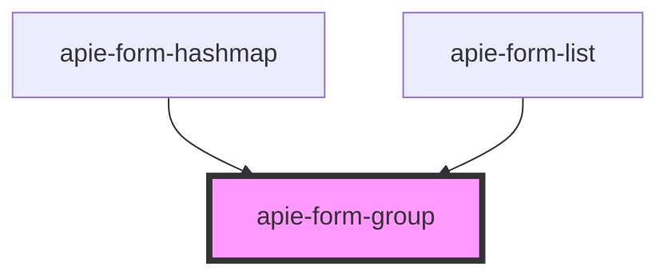

# apie-form-group

<!-- Auto Generated Below -->

## Properties

| Property          | Attribute | Description | Type                    | Default                |
| ----------------- | --------- | ----------- | ----------------------- | ---------------------- |
| `apie`            | --        |             | `Symbol`                | `APIE_FORM_CONTROLLER` |
| `internalState`   | --        |             | `{ [x: string]: any; }` | `{}`                   |
| `label`           | `label`   |             | `string`                | `null`                 |
| `name`            | `name`    |             | `string`                | `undefined`            |
| `validationError` | --        |             | `{ [x: string]: any; }` | `{}`                   |
| `value`           | --        |             | `{ [x: string]: any; }` | `{}`                   |

## Events

| Event                  | Description | Type                       |
| ---------------------- | ----------- | -------------------------- |
| `triggerChange`        |             | `CustomEvent<ChangeEvent>` |
| `triggerInternalState` |             | `CustomEvent<ChangeEvent>` |

## Dependencies

### Used by

 - [apie-form-hashmap](../apie-form-hashmap)
 - [apie-form-list](../apie-form-list)

### Graph

----------------------------------------------

*Built with [StencilJS](https://stenciljs.com/)*
