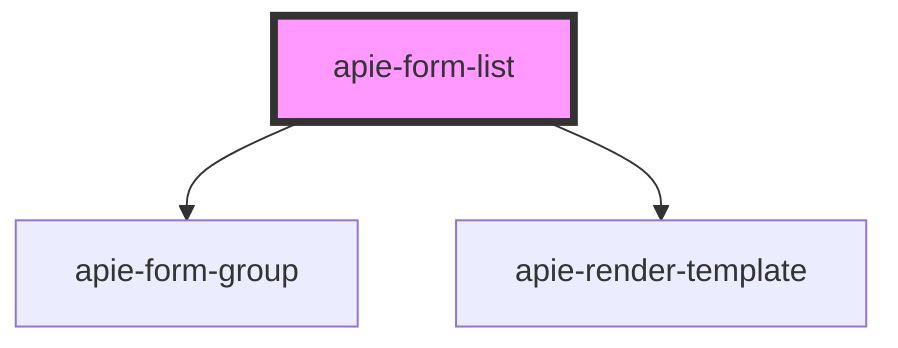

# apie-form-list

<!-- Auto Generated Below -->

## Properties

| Property          | Attribute        | Description | Type                    | Default                |
| ----------------- | ---------------- | ----------- | ----------------------- | ---------------------- |
| `apie`            | --               |             | `Symbol`                | `APIE_FORM_CONTROLLER` |
| `name`            | `name`           |             | `string`                | `undefined`            |
| `replaceString`   | `replace-string` |             | `string`                | `undefined`            |
| `templateId`      | `template-id`    |             | `string`                | `undefined`            |
| `validationError` | --               |             | `{ [x: string]: any; }` | `{}`                   |
| `value`           | --               |             | `any[]`                 | `[]`                   |

## Events

| Event           | Description | Type                       |
| --------------- | ----------- | -------------------------- |
| `triggerChange` |             | `CustomEvent<ChangeEvent>` |

## Dependencies

### Depends on

- [apie-form-group](../apie-form-group)
- [apie-render-template](../apie-render-template)

### Graph

----------------------------------------------

*Built with [StencilJS](https://stenciljs.com/)*
