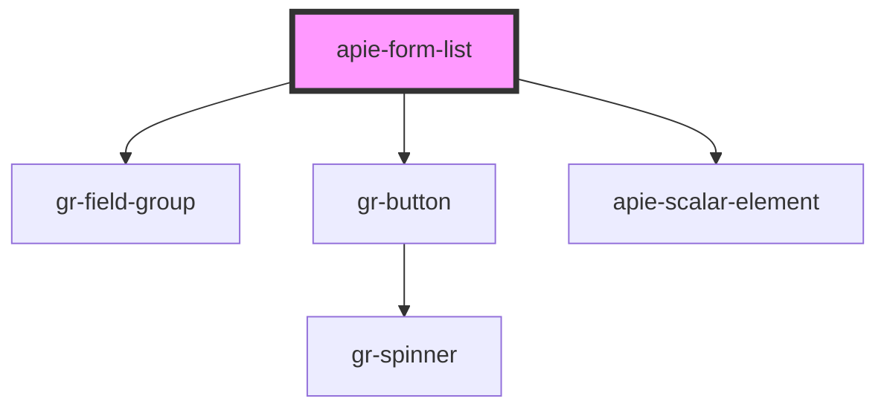

# apie-form-list

<!-- Auto Generated Below -->

## Properties

| Property        | Attribute        | Description | Type     | Default       |
| --------------- | ---------------- | ----------- | -------- | ------------- |
| `label`         | `label`          |             | `string` | `''`          |
| `name`          | `name`           |             | `string` | `undefined`   |
| `replaceString` | `replace-string` |             | `string` | `'__PROTO__'` |
| `templateId`    | `template-id`    |             | `string` | `undefined`   |
| `value`         | --               |             | `any[]`  | `[]`          |

## Events

| Event   | Description | Type                 |
| ------- | ----------- | -------------------- |
| `input` |             | `CustomEvent<any[]>` |

## Dependencies

### Depends on

- gr-field-group
- gr-button
- [apie-scalar-element](../apie-scalar-element)

### Graph

----------------------------------------------

*Built with [StencilJS](https://stenciljs.com/)*
