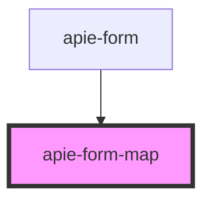

# apie-form-map

<!-- Auto Generated Below -->

## Properties

| Property      | Attribute      | Description | Type                    | Default                    |
| ------------- | -------------- | ----------- | ----------------------- | -------------------------- |
| `label`       | `label`        |             | `string`                | `null`                     |
| `name`        | `name`         |             | `string`                | `undefined`                |
| `renderInfo`  | `render-info`  |             | `RenderInfo`            | `new FallbackRenderInfo()` |
| `subElements` | `sub-elements` |             | `VNode[]`               | `undefined`                |
| `types`       | `types`        |             | `string`                | `''`                       |
| `value`       | `value`        |             | `{ [x: string]: any; }` | `undefined`                |

## Events

| Event           | Description | Type                       |
| --------------- | ----------- | -------------------------- |
| `triggerChange` |             | `CustomEvent<ChangeEvent>` |

## Dependencies

### Used by

 - [apie-form](../apie-form)

### Graph

----------------------------------------------

*Built with [StencilJS](https://stenciljs.com/)*
