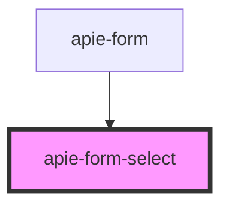

# apie-form-select

<!-- Auto Generated Below -->

## Properties

| Property                | Attribute                 | Description | Type                                            | Default                    |
| ----------------------- | ------------------------- | ----------- | ----------------------------------------------- | -------------------------- |
| `internalState`         | `internal-state`          |             | `{ [x: string]: any; }`                         | `{}`                       |
| `label`                 | `label`                   |             | `string`                                        | `null`                     |
| `name`                  | `name`                    |             | `string`                                        | `undefined`                |
| `options`               | `options`                 |             | `Option[]`                                      | `[]`                       |
| `renderInfo`            | `render-info`             |             | `RenderInfo`                                    | `new FallbackRenderInfo()` |
| `serverValidationError` | `server-validation-error` |             | `{ [key: string]: NestedRecordField<string>; }` | `{}`                       |
| `subElements`           | `sub-elements`            |             | `VNode[]`                                       | `undefined`                |
| `value`                 | `value`                   |             | `{ [x: string]: any; }`                         | `undefined`                |

## Events

| Event                  | Description | Type                       |
| ---------------------- | ----------- | -------------------------- |
| `triggerChange`        |             | `CustomEvent<ChangeEvent>` |
| `triggerInternalState` |             | `CustomEvent<ChangeEvent>` |

## Dependencies

### Used by

 - [apie-form](../apie-form)

### Graph

----------------------------------------------

*Built with [StencilJS](https://stenciljs.com/)*
