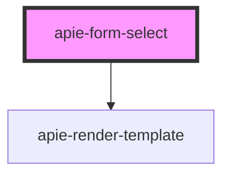

# apie-form-select

<!-- Auto Generated Below -->

## Properties

| Property        | Attribute        | Description | Type                    | Default                |
| --------------- | ---------------- | ----------- | ----------------------- | ---------------------- |
| `apie`          | --               |             | `Symbol`                | `APIE_FORM_CONTROLLER` |
| `internalState` | --               |             | `{ [x: string]: any; }` | `{}`                   |
| `name`          | `name`           |             | `string`                | `undefined`            |
| `options`       | --               |             | `Option[]`              | `undefined`            |
| `replaceString` | `replace-string` |             | `string`                | `undefined`            |
| `value`         | `value`          |             | `string`                | `undefined`            |

## Events

| Event                  | Description | Type                       |
| ---------------------- | ----------- | -------------------------- |
| `triggerChange`        |             | `CustomEvent<ChangeEvent>` |
| `triggerInternalState` |             | `CustomEvent<ChangeEvent>` |

## Dependencies

### Depends on

- [apie-render-template](../apie-render-template)

### Graph

----------------------------------------------

*Built with [StencilJS](https://stenciljs.com/)*
