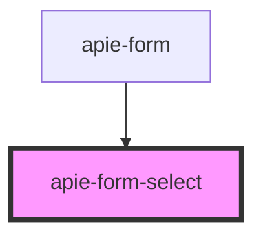

# apie-form-select

<!-- Auto Generated Below -->

## Properties

| Property        | Attribute | Description | Type                    | Default                    |
| --------------- | --------- | ----------- | ----------------------- | -------------------------- |
| `internalState` | --        |             | `{ [x: string]: any; }` | `{}`                       |
| `label`         | `label`   |             | `string`                | `null`                     |
| `name`          | `name`    |             | `string`                | `undefined`                |
| `options`       | --        |             | `Option[]`              | `[]`                       |
| `renderInfo`    | --        |             | `RenderInfo`            | `new FallbackRenderInfo()` |
| `subElements`   | --        |             | `VNode[]`               | `undefined`                |
| `value`         | --        |             | `{ [x: string]: any; }` | `undefined`                |

## Events

| Event                  | Description | Type                       |
| ---------------------- | ----------- | -------------------------- |
| `triggerChange`        |             | `CustomEvent<ChangeEvent>` |
| `triggerInternalState` |             | `CustomEvent<ChangeEvent>` |

## Dependencies

### Used by

 - [apie-form](../apie-form)

### Graph

----------------------------------------------

*Built with [StencilJS](https://stenciljs.com/)*
