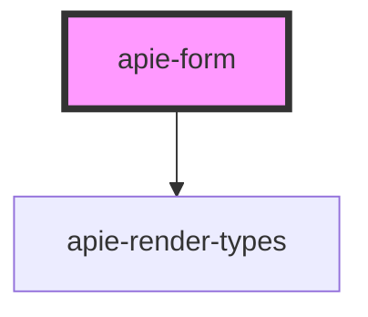

# apie-form

<!-- Auto Generated Below -->

## Properties

| Property            | Attribute            | Description | Type                    | Default                |
| ------------------- | -------------------- | ----------- | ----------------------- | ---------------------- |
| `action`            | `action`             |             | `string`                | `window.location.href` |
| `debugMode`         | `debug-mode`         |             | `boolean`               | `false`                |
| `internalState`     | --                   |             | `{ [x: string]: any; }` | `{}`                   |
| `method`            | `method`             |             | `string`                | `'post'`               |
| `submitLabel`       | `submit-label`       |             | `string`                | `'Submit'`             |
| `supportsMultipart` | `supports-multipart` |             | `boolean`               | `false`                |
| `validationError`   | --                   |             | `{ [x: string]: any; }` | `{}`                   |
| `value`             | --                   |             | `{ [x: string]: any; }` | `{}`                   |

## Dependencies

### Depends on

- [apie-render-types](../apie-render-types)

### Graph

----------------------------------------------

*Built with [StencilJS](https://stenciljs.com/)*
