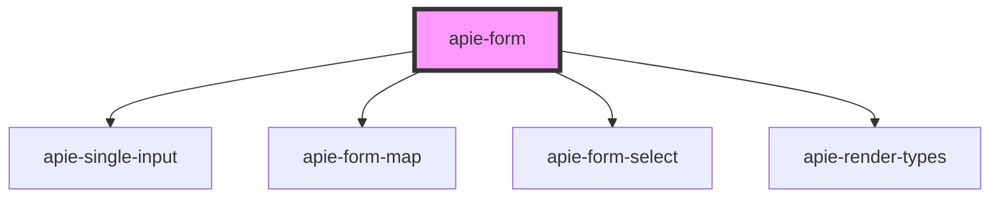

# apie-form

<!-- Auto Generated Below -->

## Properties

| Property                    | Attribute                     | Description | Type                                                 | Default                    |
| --------------------------- | ----------------------------- | ----------- | ---------------------------------------------------- | -------------------------- |
| `action`                    | `action`                      |             | `string`                                             | `window.location.href`     |
| `csrfToken`                 | `csrf-token`                  |             | `string`                                             | `null`                     |
| `debugMode`                 | `debug-mode`                  |             | `boolean`                                            | `false`                    |
| `definitionId`              | `definition-id`               |             | `string`                                             | `undefined`                |
| `formDefinition`            | `form-definition`             |             | `FormDefinition`                                     | `undefined`                |
| `initialValue` _(required)_ | `initial-value`               |             | `{ [key: string]: NestedRecordField<SubmitField>; }` | `undefined`                |
| `internalState`             | `internal-state`              |             | `{ [key: string]: NestedRecordField<Primitive>; }`   | `{}`                       |
| `method`                    | `method`                      |             | `string`                                             | `'post'`                   |
| `polymorphicColumnName`     | `polymorphic-column-name`     |             | `string`                                             | `undefined`                |
| `polymorphicFormDefinition` | `polymorphic-form-definition` |             | `{ [x: string]: string; }`                           | `undefined`                |
| `renderInfo`                | `render-info`                 |             | `RenderInfo`                                         | `new FallbackRenderInfo()` |
| `submitLabel`               | `submit-label`                |             | `string`                                             | `'Submit'`                 |
| `supportsMultipart`         | `supports-multipart`          |             | `boolean`                                            | `false`                    |
| `validationErrors`          | `validation-errors`           |             | `{ [key: string]: NestedRecordField<string>; }`      | `{}`                       |
| `value`                     | `value`                       |             | `{ [key: string]: NestedRecordField<SubmitField>; }` | `{}`                       |

## Dependencies

### Depends on

- [apie-single-input](../apie-single-input)
- [apie-form-map](../apie-form-map)
- [apie-form-select](../apie-form-select)
- [apie-render-types](../apie-render-types)

### Graph

----------------------------------------------

*Built with [StencilJS](https://stenciljs.com/)*
