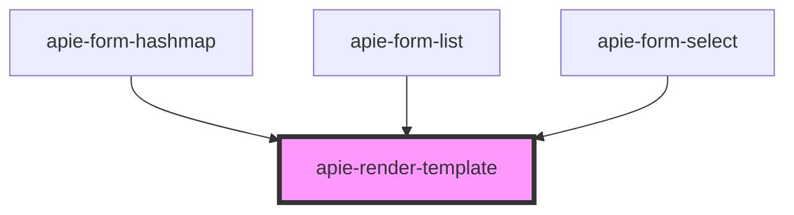

# apie-render-template

<!-- Auto Generated Below -->

## Properties

| Property        | Attribute        | Description | Type     | Default                |
| --------------- | ---------------- | ----------- | -------- | ---------------------- |
| `apie`          | --               |             | `Symbol` | `APIE_FORM_CONTROLLER` |
| `name`          | `name`           |             | `string` | `undefined`            |
| `replaceString` | `replace-string` |             | `string` | `undefined`            |
| `templateId`    | `template-id`    |             | `string` | `undefined`            |
| `value`         | `value`          |             | `any`    | `undefined`            |

## Events

| Event           | Description | Type                       |
| --------------- | ----------- | -------------------------- |
| `triggerChange` |             | `CustomEvent<ChangeEvent>` |

## Dependencies

### Used by

 - [apie-form-hashmap](../apie-form-hashmap)
 - [apie-form-list](../apie-form-list)
 - [apie-form-select](../apie-form-select)

### Graph

----------------------------------------------

*Built with [StencilJS](https://stenciljs.com/)*
