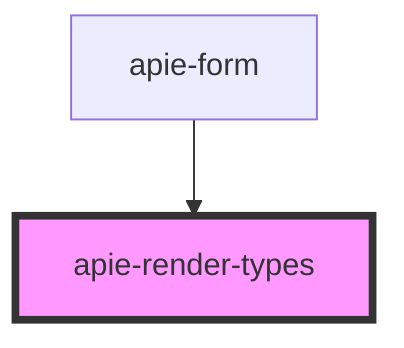

# apie-render-types

<!-- Auto Generated Below -->

## Properties

| Property            | Attribute            | Description | Type                    | Default |
| ------------------- | -------------------- | ----------- | ----------------------- | ------- |
| `csrfToken`         | `csrf-token`         |             | `string`                | `null`  |
| `internalState`     | `internal-state`     |             | `{ [x: string]: any; }` | `{}`    |
| `supportsMultipart` | `supports-multipart` |             | `boolean`               | `false` |
| `value`             | `value`              |             | `{ [x: string]: any; }` | `{}`    |

## Dependencies

### Used by

 - [apie-form](../apie-form)

### Graph

----------------------------------------------

*Built with [StencilJS](https://stenciljs.com/)*
