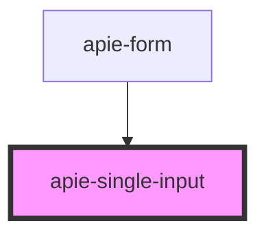

# apie-single-input

<!-- Auto Generated Below -->

## Properties

| Property                | Attribute              | Description | Type                                            | Default                                   |
| ----------------------- | ---------------------- | ----------- | ----------------------------------------------- | ----------------------------------------- |
| `additionalSettings`    | --                     |             | `SingleFieldSettings`                           | `{}`                                      |
| `allowsNull`            | `allows-null`          |             | `boolean`                                       | `false`                                   |
| `emptyStringAllowed`    | `empty-string-allowed` |             | `boolean`                                       | `false`                                   |
| `internalState`         | `internal-state`       |             | `any`                                           | `{}`                                      |
| `label`                 | `label`                |             | `string`                                        | `null`                                    |
| `name`                  | `name`                 |             | `string`                                        | `undefined`                               |
| `renderInfo`            | --                     |             | `RenderInfo`                                    | `new FallbackRenderInfo()`                |
| `required`              | `required`             |             | `boolean`                                       | `false`                                   |
| `serverValidationError` | --                     |             | `{ [key: string]: NestedRecordField<string>; }` | `{}`                                      |
| `types`                 | `types`                |             | `string`                                        | `''`                                      |
| `validationResult`      | --                     |             | `ValidationResult`                              | `{     valid: true,     messages: []   }` |
| `value`                 | `value`                |             | `string`                                        | `undefined`                               |

## Events

| Event                  | Description | Type                       |
| ---------------------- | ----------- | -------------------------- |
| `internalStateChanged` |             | `CustomEvent<any>`         |
| `touched`              |             | `CustomEvent<ChangeEvent>` |
| `triggerChange`        |             | `CustomEvent<ChangeEvent>` |

## Dependencies

### Used by

 - [apie-form](../apie-form)

### Graph

----------------------------------------------

*Built with [StencilJS](https://stenciljs.com/)*
